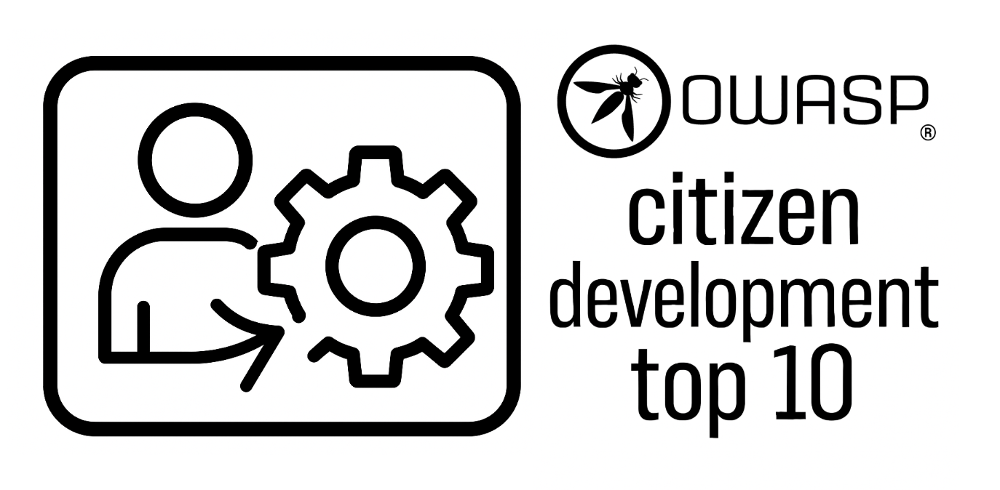

# OWASP Citizen Development Top 10

https://owasp.org/www-project-citizen-development-top10-security-risks/

The primary goal of the "OWASP Citizen Development Top 10" document is to provide assistance and education for organizations looking to adopt a culture of security for their Citizen Development environments. The guide provides information about what the most prominent security risks are for such applications, the challenges involved, and how to overcome them.

## Want to help? 

We are always researching, updating the guide, and welcoming contributors to the project.

[Read our contributing guidelines here.](CONTRIBUTING.md)

